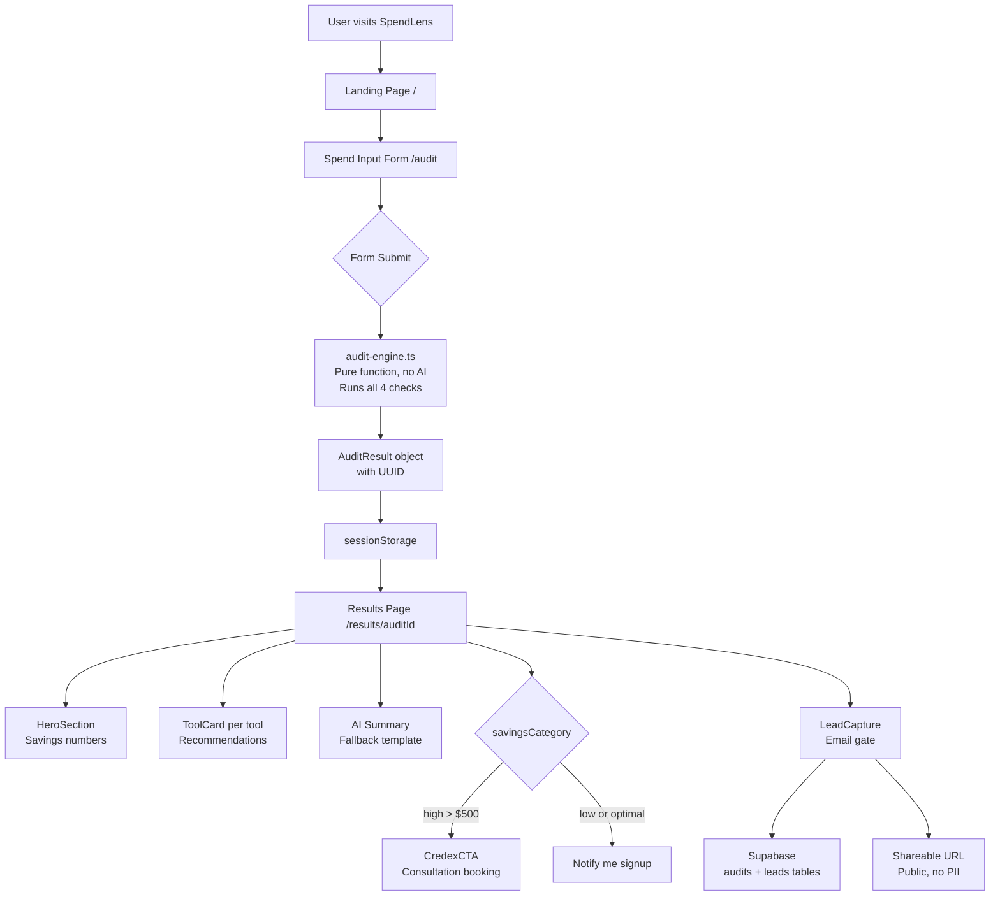

# ARCHITECTURE.md

## System Diagram

---

## Data Flow

1. **User fills form** → `FormData` object built in browser with localStorage persistence
2. **Form submits** → `runAudit(formData)` called client-side in `SpendForm/index.tsx`
3. **Audit engine runs** → pure TypeScript function, no network calls, returns `AuditResult` with UUID in ~1ms
4. **Result stored** → `sessionStorage` used to pass data to results page without URL params
5. **Results page loads** → reads from sessionStorage, renders all components
6. **Lead capture** → on email submit, audit saved to Supabase `audits` table, lead saved to `leads` table
7. **Shareable URL** → `/results/[auditId]` is public but strips email and company name

---

## Why Next.js 14 App Router

- **Server components** for the landing page mean zero JS sent to client for static content
- **Dynamic routes** (`/results/[auditId]`) handle shareable URLs natively
- **API routes** available for lead storage and future Anthropic API integration
- **Vercel deployment** is one command with zero config
- TypeScript support is first-class

Considered Vue + Vite but Next.js won on deployment simplicity and the App Router's server/client component split which matters for Lighthouse scores.

---

## Why Supabase

- Free tier handles the expected load for an MVP
- Postgres under the hood — real relational DB, not a toy
- Row Level Security available when needed
- SDK works seamlessly with Next.js App Router
- No vendor lock-in — standard Postgres can be migrated anywhere

Considered Firebase but Supabase's SQL interface makes the audit data queryable for Credex's sales team without writing custom queries.

---

## Why the Audit Engine Has No AI

The audit logic is deterministic:
- $20 < $100 is always true
- 1 seat < 2 seat minimum is always a mismatch
- Two coding assistants is always redundant

Using an LLM for this introduces hallucination risk, latency, and cost with zero upside. AI is used exactly once — for the personalized summary paragraph — because that is the only place where natural language generation adds value that rules cannot replicate.

---

## What I Would Change at 10k Audits/Day

1. **Move audit engine to API route** — currently runs client-side which is fine for MVP but at scale you want server-side execution to protect pricing logic and enable caching
2. **Add Redis cache** — audit results for identical inputs can be cached, reducing Supabase writes
3. **Queue lead emails** — replace direct Resend calls with a queue (BullMQ or Inngest) to handle spikes
4. **Add audit versioning** — pricing data changes weekly; store the pricing snapshot used for each audit so old reports remain accurate
5. **Rate limiting** — add Upstash Redis rate limiting on the audit API route to prevent abuse
6. **CDN for OG images** — generate dynamic OG images server-side with `@vercel/og` and cache at edge